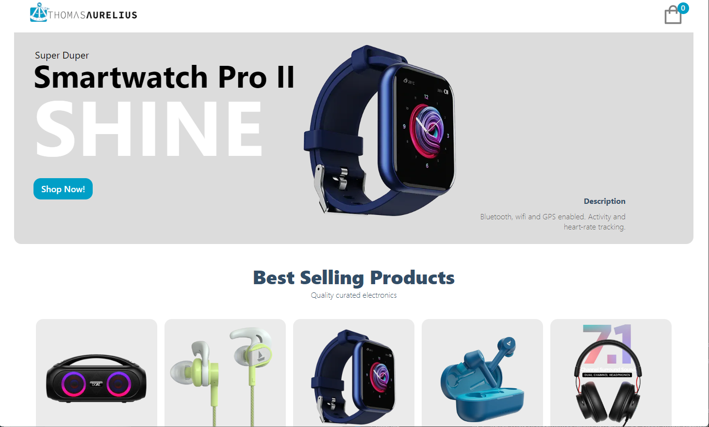

# Full Stack E-commerce webshop

This is a [Next.js](https://nextjs.org/) project bootstrapped with [`create-next-app`](https://github.com/vercel/next.js/tree/canary/packages/create-next-app).

## Getting Started

## Available Scripts

First, run the development server:

```bash
npm run dev
# or
yarn dev
```

Open [http://localhost:3000](http://localhost:3000) with your browser to see the result.

You can start editing the page by modifying `pages/index.js`. The page auto-updates as you edit the file.

[API routes](https://nextjs.org/docs/api-routes/introduction) can be accessed on [http://localhost:3000/api/hello](http://localhost:3000/api/hello). This endpoint can be edited in `pages/api/hello.js`.

The `pages/api` directory is mapped to `/api/*`. Files in this directory are treated as [API routes](https://nextjs.org/docs/api-routes/introduction) instead of React pages.

## Table of contents

-  [Overview](#overview)
   -  [Screenshot](#screenshot)
   -  [Links](#links)
-  [My process](#my-process)
   -  [Built with](#built-with)
   -  [What I learned](#what-i-learned)
   -  [Continued development](#continued-development)
   -  [Useful resources](#useful-resources)
-  [Author](#author)
-  [Acknowledgments](#acknowledgments)

## Overview

Version 2.0 - Added localStorage tied to state for persistent cartItems usage.

### Screenshot



### Links

-  Solution URL: [GitHub](https://github.com/ThomasAurelius/ecommerce)
-  Live Site URL: [Live URL](https://ecommerce-zeta-three.vercel.app/)

## My process

### Built with

-  React
-  NextJS
-  Sanity
-  Stripe
-  Mobile-first workflow

### What I learned

This was my first project with NextJS and I am loved working with it.

### Continued development

I will continue to work on accessibility issues and improvements.
I want to add an inventory count of each item, and categories for pagination.

### Useful resources

-  Video this build was based on: (https://www.youtube.com/watch?v=4mOkFXyxfsU&t=5899s). I had a hard time following along this video, and acheiving the same results. My system setup is different than the authors, making some of the CLI commands different- such as requiring NPX prefixes. I had to correct many issues that the video did not cover.

## Author

-  Website - [Thomas Aurelius](https://thomasaurelius.com)
-  Twitter - [@thomasaurelius4](https://www.twitter.com/thomasaurelius4)

## Acknowledgments

JavascriptMastery - for making this video, which helped me connect the Sanity and Stripe modules.
Kevin Powell, for being a CSS king! I've learned so much from him and his workflows, I am grateful he puts out so many awesome videos.
Brad Traversy - Traversy Media, an amazing youtube instructor!
Leon Noel - 100devs instructor extraordinaire!
